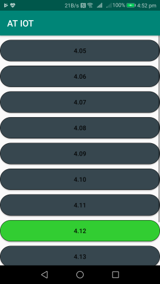

# Internet of Things Room Occupancy Detection System
This is a full stack implementation of the coursework for the Internet of Things, Systems, Security and the Cloud course taught at the University of Edinburgh in 2019.

## Project Outline
This system consists of: 
* Firmware for a Nodric NRF51
* An Android application gateway
* A server to handle data processing
* A website to visualize the processed data
* A User side application to view the website

## Environment
This project was conducted in Room 3.09 in Appleton Tower at the University of Edinburgh.
*Insert a system diagram here or something too*

## Firmware

## Android Gateway

## Server

## Website

## User Side Application

## MIT Licence

Copyright (c) 2018 [Mahbub Iftekhar](https://www.mahbubiftekhar.co.uk/) & [Rusab Abrez Asher](https://github.com/BerserkerLan)

Permission is hereby granted, free of charge, to any person obtaining a copy
of this software and associated documentation files (the "Software"), to deal
in the Software without restriction, including without limitation the rights
to use, copy, modify, merge, publish, distribute, sublicense, and/or sell
copies of the Software, and to permit persons to whom the Software is
furnished to do so, subject to the following conditions:

The above copyright notice and this permission notice shall be included in all
copies or substantial portions of the Software.

THE SOFTWARE IS PROVIDED "AS IS", WITHOUT WARRANTY OF ANY KIND, EXPRESS OR
IMPLIED, INCLUDING BUT NOT LIMITED TO THE WARRANTIES OF MERCHANTABILITY,
FITNESS FOR A PARTICULAR PURPOSE AND NONINFRINGEMENT. IN NO EVENT SHALL THE
AUTHORS OR COPYRIGHT HOLDERS BE LIABLE FOR ANY CLAIM, DAMAGES OR OTHER
LIABILITY, WHETHER IN AN ACTION OF CONTRACT, TORT OR OTHERWISE, ARISING FROM,
OUT OF OR IN CONNECTION WITH THE SOFTWARE OR THE USE OR OTHER DEALINGS IN THE
SOFTWARE.
